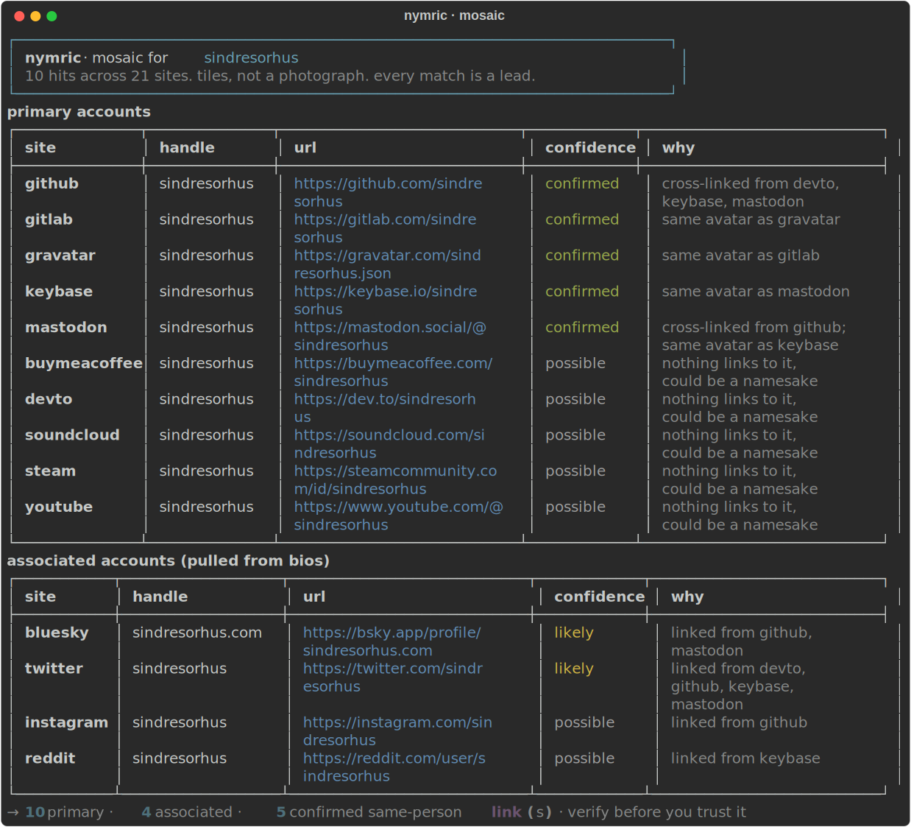

# nymric

[](https://github.com/m1h/nymric/actions/workflows/ci.yml)
[](https://pypi.org/project/nymric/)


[](https://github.com/astral-sh/ruff)

check a username (or an email) across a pile of public sites, follow the links on
whatever profiles show up, and stitch it all into one picture of a single person with a
confidence on each piece.

> tiles, not a photograph. a match is a lead, not proof.



## the idea

most tools here (sherlock, whatsmyname, enola) answer one question: does this handle
exist on N sites. useful, but you get a flat wall of hits and you're the one left working
out which are the same person and which are some stranger with the same name. nymric
spends its effort on that second part.

## what it does

- checks a username across a curated set of sites, all at once
- reads the outbound links on the profiles that expose them and pulls the person's other
  accounts out of the bio (their twitter, twitch, a linked github, whatever)
- ties it together. if dev.to and keybase both point at a github we found, that github is
  `confirmed`. a lone hit with nothing backing it is `possible` (might be a stranger),
  not dressed up as a sure thing
- matches profile pictures too. two accounts with the same photo (perceptual hash, run on
  your machine) is a `confirmed` link even when no bio connects them
- takes an email as well. it hashes the email, finds the public gravatar profile, and
  pivots on the username that comes back. no password-reset probing, just what gravatar
  already hands out
- prints a short mosaic, or `--json` / `--md` / `--svg` if you want it elsewhere

## what it's for, and what it won't do

it's for checking your own exposure, brand and impersonation monitoring, and authorized
research. it won't do logins, auth, anything behind a wall, bulk "find everyone", or
dodging anti-bot. public data only. the [ethics](ETHICS.md) file is short and it's the
actual point.

## install

the easy way (once it's on pypi):

```
pipx install nymric
```

or from source:

```
git clone https://github.com/m1h/nymric
cd nymric
pip install .
```

python 3.11+, two deps (httpx, rich). want avatar matching too? `pip install "nymric[avatars]"`
pulls in pillow. everything else runs without it.

## quickstart

point it at a handle:

```
nymric torvalds
```

you get back the accounts that handle shows up on, grouped by how sure it is they're the
same person, each with the reason why. add `--json` or `--md report.md` to save it. the
picture at the top of this readme is a real run.

## usage

```
nymric <username|email> [options]

  -s, --sites NAME...   only these sites (e.g. -s github lichess)
  -c, --concurrency N   parallel requests (default 10)
  -t, --timeout SECS    per-request timeout (default 10)
      --no-follow       don't follow bio links, existence only
      --no-avatars      don't hash profile pictures
      --ua STRING       user-agent override
      --json            json to stdout
      --md FILE          also write a markdown report
      --svg FILE         also save an svg screenshot
  -V, --version
```

give it an email instead and it goes through gravatar first:

```
nymric someone@example.com
```

## how it compares

| tool | what you get back |
|---|---|
| sherlock / enola | whether the handle exists on ~400 sites (flat list, verify it yourself) |
| whatsmyname | a curated existence dataset and a browser app |
| maigret | existence plus a recursive search of the same handle, big dump |
| nymric | follows bio links to the person's other accounts and ties them into one mosaic, each piece with a confidence and the reason it's there |

## how it works

every site is a row of data, not code, in [nymric/data/sites.json](nymric/data/sites.json):

```json
{"name": "github", "url": "https://github.com/{}", "method": "status", "links": true}
```

`status` sites are judged on 200 vs 404. `text` sites carry a `found` marker (a string
only real profiles contain) or an `absent` marker (the "not found" string, for sites like
steam that return 200 either way). a `{}` in a marker gets the handle.

the rule that matters most: 403 / 429 / 5xx never count as "missing", they count as
inconclusive. a bot-block is not proof the account isn't there. that is the biggest source
of junk results in tools that skip it, and it's why reddit isn't on the list (its edge
serves identical 403s for real and fake users when you aren't logged in).

adding a site is a json edit. the rest is a handful of small files: `probe`, `links`,
`stitch`, `faces`, `mailto`. there's a longer writeup in [DESIGN.md](DESIGN.md).

## honest about the limits

- usernames aren't unique. a `possible` hit really might be someone else. that's why it's
  flagged instead of hidden.
- the list is small on purpose (27 sites). big lists rot. these are ones that behave
  without an anti-bot wall. reddit, instagram, tiktok, x need auth or block you, so they're
  left out instead of faked.
- markers break when a site redesigns. it's data, so the fix is one line.

## prior art

built on the shoulders of [sherlock](https://github.com/sherlock-project/sherlock),
[maigret](https://github.com/soxoj/maigret), and the
[whatsmyname](https://github.com/WebBreacher/WhatsMyName) dataset. the angle here is the
correlation layer they leave to you.

## license

MIT. lawful research only, no warranty.
